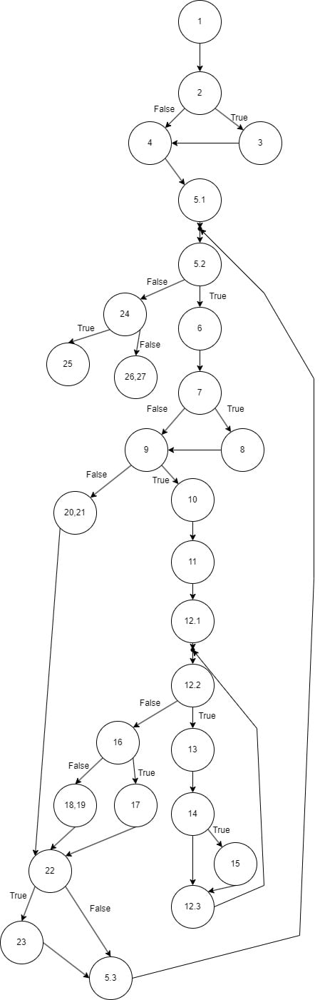

#Teofanija, Bravo 214002

## Control Flow Graph

## Цикломатска комплексност

Цикломатската комплексност е дефинирана со `V(G) = E - N + 2`, каде што `E` е број на ребра и `N` е број на јазли на CFG.

`V(G) = 35 - 27 + 2 = 10`

Цикломатската комплексност на кодот изнесува 10.

